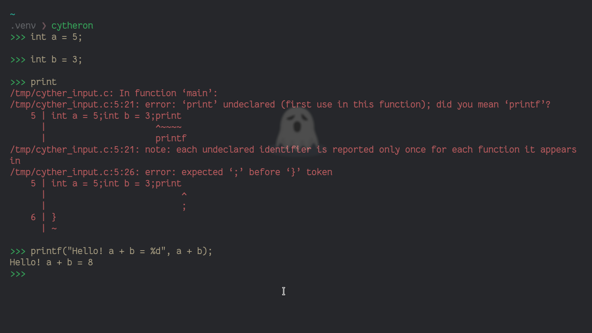

# cyther

[](https://opensource.org/licenses/MIT)

A simple interpreter for the C programming language, made with Python.

---



---

## Setup

- Clone the repository
  ```bash
  git clone https://github.com/johnvictorfs/cytheron && cd cytheron
  ```

- Install dependencies with [poetry](https://github.com/python-poetry/poetry)
  ```bash
  poetry install
  ```

- Run with `cytheron`
